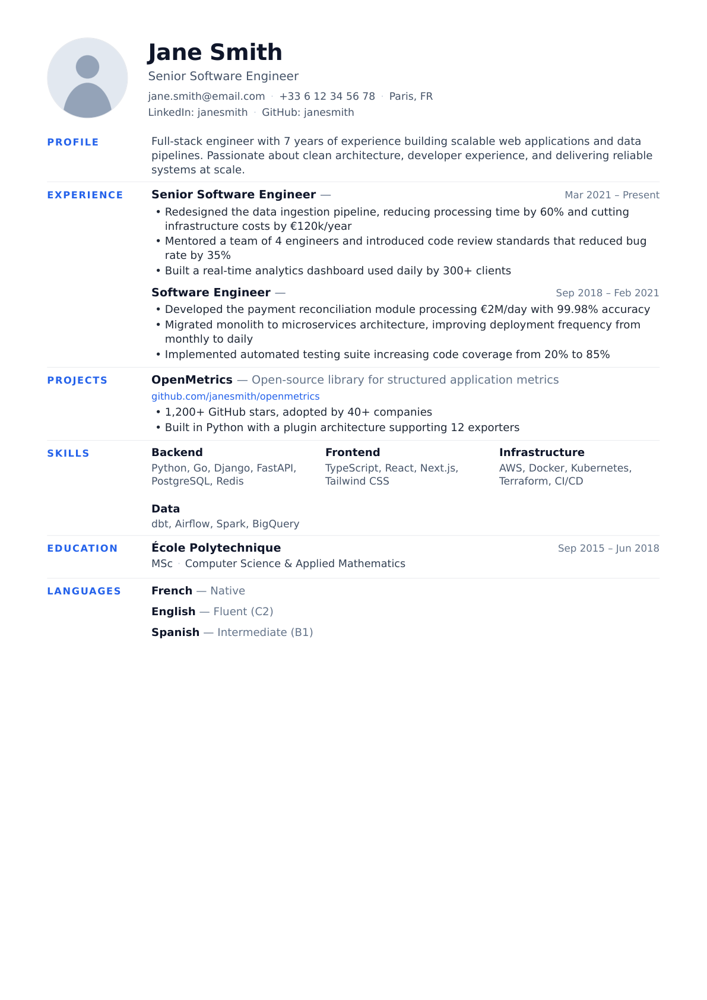

# llm-skills

## cv-tailor

Tailors your CV to a specific job offer. Best used in **Claude Web** (claude.ai) with project knowledge bases set up.

**Workflow:**
1. Paste or upload the job offer (text, URL, screenshot, or PDF)
2. Claude adapts your CV and renders an HTML preview — open it to review
3. Request corrections as needed; Claude edits the YAML surgically (no full regeneration)
4. Once satisfied, ask Claude to generate the final PDF

**Requires setup before use:** wire your own background knowledge bases and photo as described in [`cv-tailor/SKILL.md`](cv-tailor/SKILL.md).
